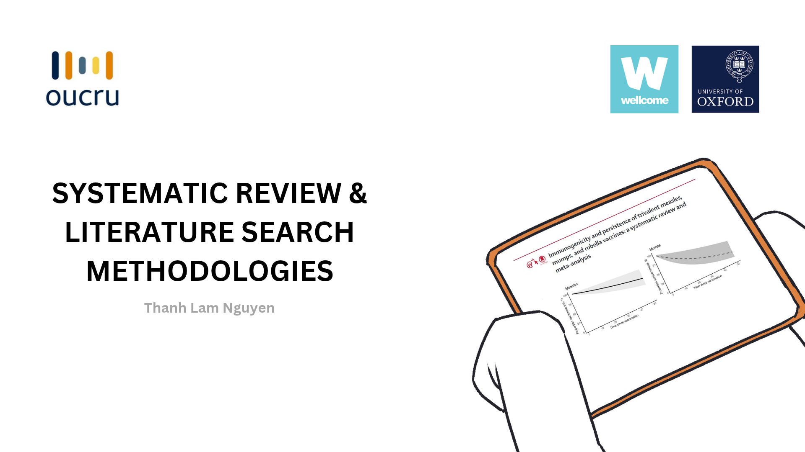

## Systematic Review & Literature Search Methodologies

::: {.grid}

::: {.g-col-12 .g-col-md-5}

:::

::: {.g-col-12 .g-col-md-7}

**Date:** November 2023 | **Role:** Trainer

**Host Organization:** Ho Chi Minh City Center for Disease Control (HCDC) & Oxford University Clinical Research Unit (OUCRU)

**Target Audience:** Public health practitioners and staff members at HCDC (approx. 30 participants)

**Topic:** *Systematic Review Methodology & Scientific Research*

- Delivered a training session on systematic review methodology and data analysis in health research for public health staff at HCDC under the strategic collaboration framework between HCDC and OUCRU.
- Guided participants through the fundamentals of conducting systematic literature reviews, search strategies, and evidence synthesis.

:::
:::

